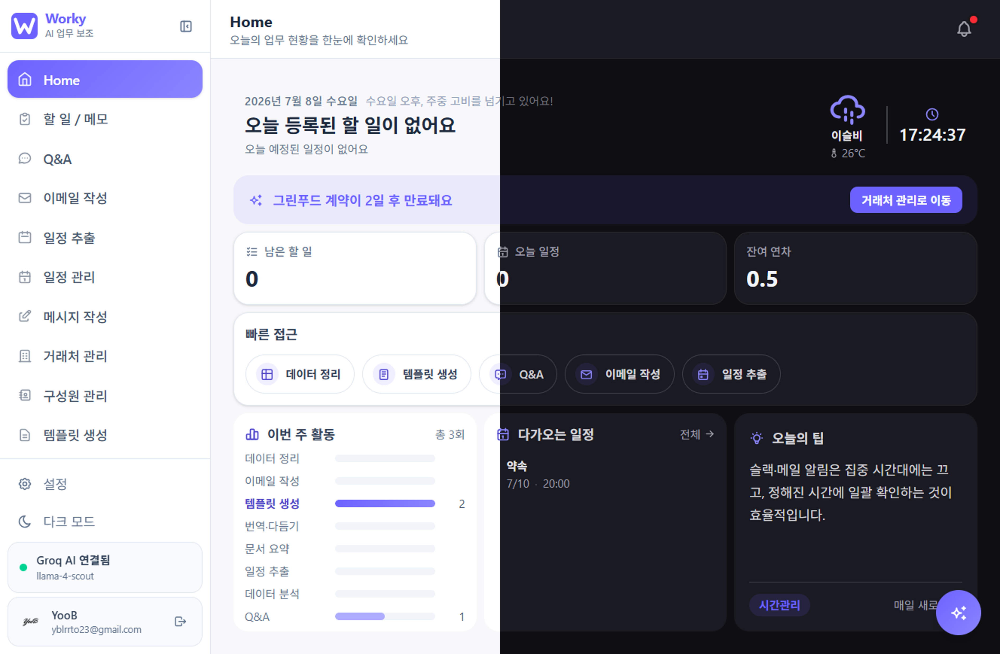
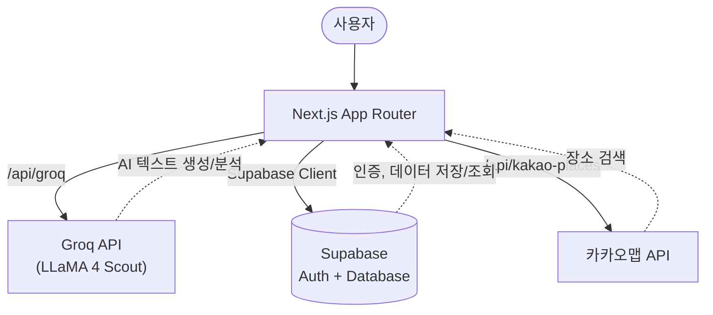
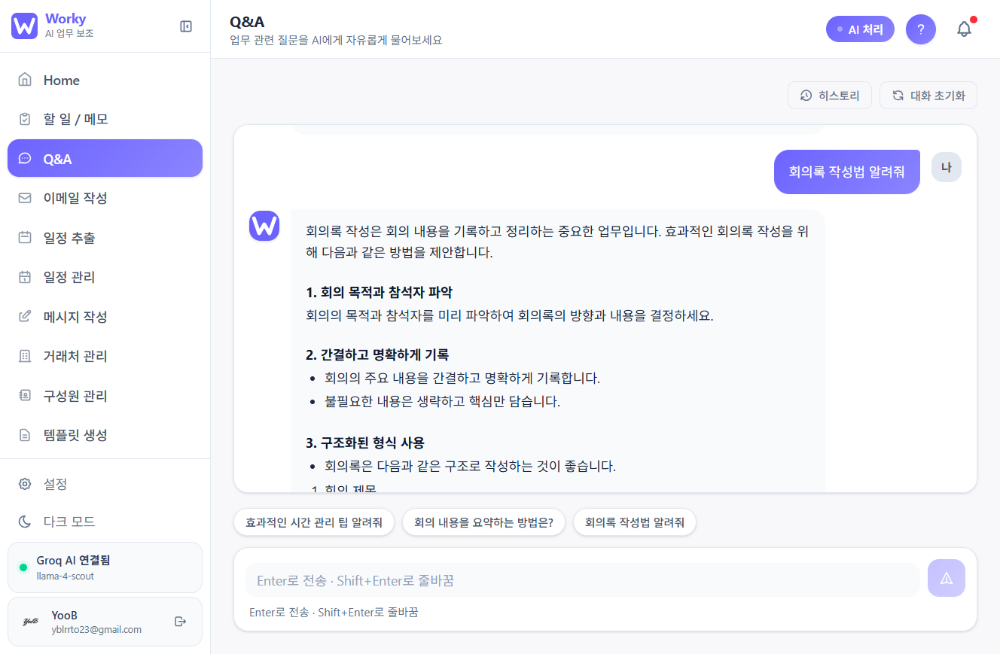
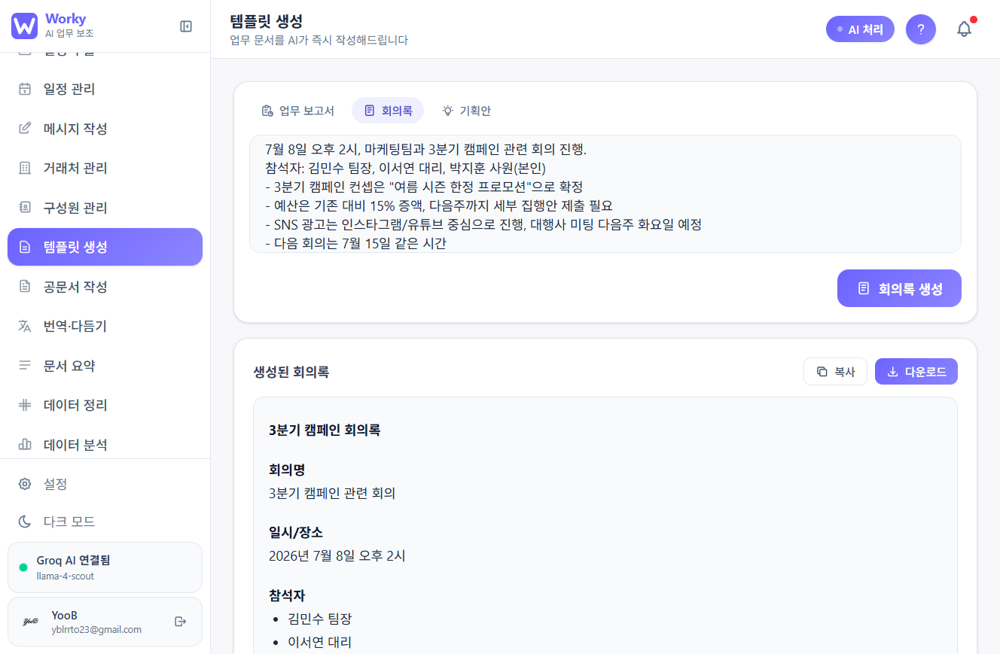
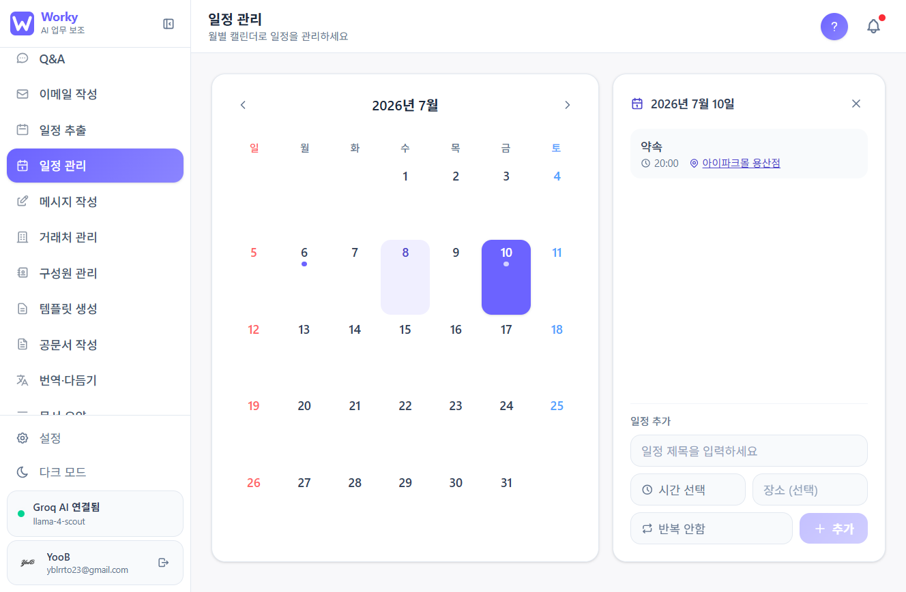
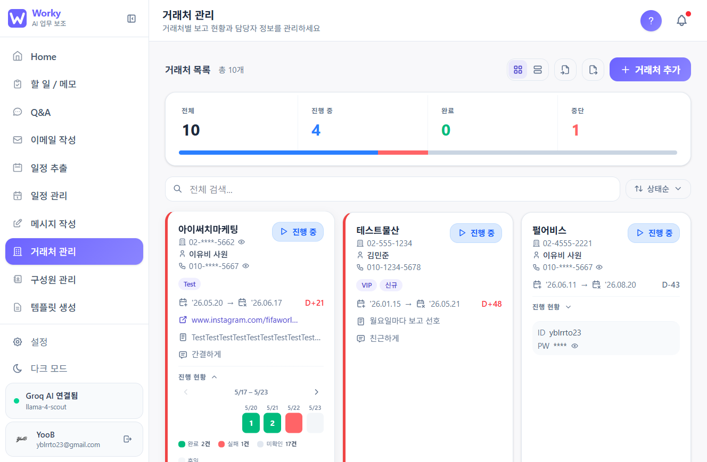

<div align="center">

# 🅦 Worky

### AI 업무 보조 도구

신입 사무직 직장인을 위한 AI 기반 업무 보조 웹 앱

반복적인 업무 문서 작성, 일정 정리, 거래처 관리 등을 AI가 빠르게 처리해 드립니다.

**[🔗 지금 사용해보기](https://worky-ai.vercel.app)**

<br/>


</div>

<br/>

<p align="center">
  
</p>

<br/>

<details>
<summary><strong>📑 목차</strong></summary>
<br/>

- [왜 만들었나](#왜-만들었나)
- [기술 스택](#기술-스택)
- [아키텍처](#아키텍처)
- [주요 기능](#주요-기능)
- [트러블슈팅 & 배운 점](#트러블슈팅--배운-점)
- [프로젝트 구조](#프로젝트-구조)
- [로컬 실행 방법](#로컬-실행-방법)
- [환경변수](#환경변수)
- [라이선스](#라이선스)

</details>

<br/>

## 왜 만들었나

신입사원 시절, 문서 작성 양식을 매번 찾아보고, 거래처 정보를 여러 곳에 흩어놓고 관리하고, 일정을 놓치는 일이 반복됐습니다.
Worky는 이런 반복 업무를 AI에게 맡기고, 정작 중요한 판단과 소통에 시간을 쓸 수 있도록 만든 개인 프로젝트입니다.

QA 엔지니어로 2년간 일하며 봐온 "사용자가 실제로 헷갈려하는 지점"을 기능 설계에 반영하려 했습니다.
예를 들어 인증 타이머가 화면상 60초로 표시되지만 실제로는 30초 만에 만료되거나, 카운트다운이
1초씩 균일하게 줄지 않고 2초씩 건너뛰는 결함을 QA 시절 발견한 경험이 있습니다. 화면에 보이는
시간과 실제 시스템 동작이 어긋나면 사용자는 혼란을 넘어 서비스를 신뢰하지 못하게 됩니다.
Worky의 계약 D-day 계산이나 잔여 연차 계산 같은 날짜 기반 기능에서, 표시값과 실제 계산 로직이
정확히 일치하는지를 QA 시절 습관대로 꼼꼼히 검증하며 개발했습니다.

<br/>

## 기술 스택

| 영역 | 기술 |
|---|---|
| **Frontend** | Next.js 15 (App Router), TypeScript, Tailwind CSS |
| **AI** | Groq API, LLaMA 4 Scout |
| **인증 / DB** | Supabase (Auth + Database), Google OAuth, Gmail API |
| **배포** | Vercel |

> **왜 Groq + LLaMA 4 Scout인가?**
> 무료 티어가 충분하고, 한국에서 제약 없이 사용 가능하며, 동급 모델 대비 응답 속도가 매우 빠릅니다.

> 이 프로젝트는 Claude Code를 아키텍처 설계 및 구현 보조 도구로 활용해 개발했으며,
> 직접 설계한 부분과 AI로 가속화한 부분은 트러블슈팅 섹션에 구체적으로 명시했습니다.

<br/>

## 아키텍처



- 클라이언트에서 직접 Groq API를 호출하지 않고, `/api/groq` 서버 라우트를 경유해 API 키를 보호합니다.
- 로그인은 Supabase Auth + Google OAuth를 사용하며, 로그인 세션을 기반으로 각 API 라우트에서 인증 여부를 검사합니다.

<br/>

## 주요 기능

### 🏠 홈 & 개인화

<details>
<summary><strong>홈 대시보드</strong></summary>
<br/>

오늘의 업무 현황을 AI가 요약해서 보여주고, 핵심 지표와 실사용 패턴 기반 추천 기능을 함께 제공합니다.
플로팅 바로가기 버튼으로 자주 쓰는 외부 사이트에 빠르게 접근할 수 있으며, 기본 제공 링크(Claude, ChatGPT, Gemini, 구글, 노션, Gmail, 네이버, Google Drive) 외에 커스텀 바로가기를 직접 추가할 수 있습니다. 유명 사이트는 브랜드 아이콘이 자동으로 적용됩니다.

</details>

<details>
<summary><strong>할 일 / 메모</strong></summary>
<br/>

날짜별 할 일 관리와 자유 메모를 지원합니다.
미완료 항목은 다음 날로 자동 이월되며, 업무·회의·개인 탭으로 메모를 구분해 관리합니다.

</details>

<details>
<summary><strong>설정</strong></summary>
<br/>

내 정보, 다크모드, 사이드바 메뉴 표시 항목, 직업군별 프리셋 등 앱 환경을 설정합니다.
입사일·입사 유형을 입력하면 잔여 연차를 자동으로 계산하며, 시간대·요일별 커스텀 인사말도 설정할 수 있습니다. 한국어/영어 언어 설정도 지원합니다.

</details>

### 🤖 AI 문서 · 커뮤니케이션

<details>
<summary><strong>Q&A</strong></summary>
<br/>

업무 관련 질문을 AI에게 자유롭게 물어볼 수 있습니다.
신입사원 업무 맥락을 고려한 답변과 대화 히스토리 유지를 지원하며, 답변은 마크다운으로 렌더링됩니다. 대화 시작 전에는 추천 질문을 먼저 보여드립니다.



</details>

<details>
<summary><strong>이메일 작성</strong></summary>
<br/>

- **새 이메일 작성**: 핵심 내용만 입력하면 AI가 맞춤법·표현을 다듬어 완성도 높은 이메일을 생성합니다.
- **답장 작성**: 받은 이메일을 붙여넣으면 AI가 톤에 맞는 답장 초안을 생성합니다.
- Gmail API 연동으로 앱에서 직접 이메일 전송이 가능합니다.

</details>

<details>
<summary><strong>메시지 작성</strong></summary>
<br/>

완료한 작업 내용을 입력하면 AI가 보고 메시지 또는 인스타그램 게시글을 생성합니다.
거래처별 선호 톤(간결함·수치 중심·정중체 등)을 반영한 맞춤 메시지를 작성합니다.

</details>

<details>
<summary><strong>템플릿 생성</strong></summary>
<br/>

업무보고서, 회의록, 기획안, 공문서 등 업무 문서를 AI가 즉시 작성합니다.
결과물은 인라인 편집 후 복사·다운로드할 수 있습니다.



</details>

<details>
<summary><strong>공문서 작성</strong></summary>
<br/>

품의서, 공문, 지출결의서, 업무협조 요청서를 AI가 즉시 작성합니다.
양식별 필수 항목을 가이드하여 누락 없이 작성할 수 있습니다.

</details>

<details>
<summary><strong>번역 · 다듬기</strong></summary>
<br/>

텍스트를 원하는 언어로 번역하거나 비즈니스 톤으로 다듬어 드립니다.
원문과 결과물을 나란히 비교할 수 있습니다.

</details>

<details>
<summary><strong>문서 요약</strong></summary>
<br/>

텍스트를 붙여넣으면 AI가 핵심 내용을 글머리·표 형식으로 요약합니다.
긴 보고서나 회의록에서 액션 아이템만 빠르게 추출하는 데 유용합니다.

</details>

<details>
<summary><strong>피드백 정리</strong></summary>
<br/>

클라이언트 피드백을 붙여넣으면 AI가 수정사항·액션 아이템으로 깔끔하게 정리합니다.
피드백의 우선순위와 담당자를 함께 정리해 팀 공유에 바로 활용할 수 있습니다.

</details>

### 📊 데이터 · 일정 · 거래처

<details>
<summary><strong>데이터 정리</strong></summary>
<br/>

지저분한 텍스트 데이터를 AI가 분석해 정형화된 표로 변환합니다.
CSV 다운로드 및 클립보드 복사를 지원합니다.

</details>

<details>
<summary><strong>데이터 분석</strong></summary>
<br/>

숫자 데이터를 붙여넣으면 AI가 핵심 수치와 트렌드를 분석합니다.
표나 CSV 형태의 데이터를 인식해 의미 있는 인사이트를 도출합니다.

</details>

<details>
<summary><strong>일정 추출</strong></summary>
<br/>

이메일·공지·메시지에서 일정 정보를 자동으로 추출해 정리합니다.
"다음주 화요일", "다음달 첫째 주 월요일" 같은 상대적 날짜도 실제 날짜로 변환합니다.

</details>

<details>
<summary><strong>일정 관리</strong></summary>
<br/>

월별 캘린더로 일정을 등록하고 관리합니다.
한국 공휴일 및 대체공휴일이 표시되며, 카카오맵 장소 검색으로 일정 장소를 바로 추가할 수 있습니다.



</details>

<details>
<summary><strong>거래처 관리</strong></summary>
<br/>

거래처별 보고 현황, 담당자 정보, 계약 기간을 통합 관리합니다.
계약 D-day 자동 계산, GitHub 스타일 잔디밭 그리드로 일별 진행 현황 시각화, 카카오맵 장소 연동을 지원합니다.



</details>

<details>
<summary><strong>구성원 관리</strong></summary>
<br/>

팀 구성원 정보를 등록하고 관리합니다.

</details>

<details>
<summary><strong>용어집</strong></summary>
<br/>

사내 용어·약어를 등록하고 AI로 뜻을 설명받을 수 있습니다.
팀마다 다른 내부 용어를 한 곳에서 관리하고 빠르게 검색합니다.

</details>

### 🌐 다국어 & 접근성

한국어/영어 전체 다국어를 지원하며, 스크린리더 호환성과 색상 대비 등 접근성 기준을 준수합니다.
각 페이지 우측 상단의 도움말 버튼을 통해 기능별 사용법을 바로 확인할 수 있습니다.

<br/>

## 트러블슈팅 & 배운 점

QA 엔지니어로 일하며 익힌 "결함을 먼저 의심하고 검증하는" 습관이 프론트엔드 개발에서도 그대로 도움이 되고 있습니다.

- **Firebase → Supabase 마이그레이션 중 데이터 유실 버그**: `localStorage` 값이 덮어써지면서 초기화 로직이 실제 사용자 데이터를 더미 데이터로 갈아치우는 문제가 있었습니다. QA 시절 습관대로 재현 조건을 좁혀가며 원인을 특정했고, `localStorage.setItem`을 직접 감싸는 방식(`originalSetItem`)으로 해결했습니다.
- **Q&A 히스토리 중복 저장**: 스트리밍 응답이 완료되기 전에 저장 로직이 여러 번 호출되던 문제를
발견했습니다. 현대오토에버 MyHyundai 앱 QA 당시, 주소 즐겨찾기를 1회 등록했는데 즐겨찾기 탭에
동일 항목이 중복으로 표시되는 결함을 찾았던 경험이 있는데, 두 사례 모두 "완료되지 않은 상태에서
저장 로직이 여러 번 실행된다"는 같은 유형의 결함이었습니다. 이 패턴을 알고 있었기에 스트리밍
완료 시점을 명확히 특정해 그 시점에만 1회 저장하도록 수정했습니다.
- **레이아웃 회귀 방지**: 모달/패널이 특정 상황에서 화면 전체를 못 덮던 오래된 버그를 포털(portal) 방식으로 근본적으로 해결했습니다.

> 더 자세한 변경 이력은 [`CHANGELOG.md`](./CHANGELOG.md)에서 확인하실 수 있습니다.

<br/>

## 프로젝트 구조

```
src/
  app/          # Next.js App Router 페이지 및 API 라우트
  components/   # UI 컴포넌트
  contexts/     # React Context (Toast 등)
  hooks/        # 커스텀 훅
  lib/          # 유틸리티, DB 함수, 설정
  types/        # TypeScript 타입 정의
```

<br/>

## 로컬 실행 방법

```bash
# 1. 저장소 클론
git clone https://github.com/yoobilee/worky.git
cd worky

# 2. 의존성 설치
npm install

# 3. 환경변수 설정
cp .env.example .env.local
# .env.local에 필요한 값 입력

# 4. 개발 서버 실행
npm run dev
```

브라우저에서 [http://localhost:3000](http://localhost:3000) 접속

<br/>

## 환경변수

`.env.local` 파일에 아래 변수를 설정하세요.

```env
# Groq API — https://console.groq.com
GROQ_API_KEY=

# Supabase — https://supabase.com
NEXT_PUBLIC_SUPABASE_URL=
NEXT_PUBLIC_SUPABASE_ANON_KEY=

# 카카오 API — https://developers.kakao.com
KAKAO_REST_API_KEY=
NEXT_PUBLIC_KAKAO_MAP_KEY=
```

> `GROQ_API_KEY`는 서버 사이드(`/api/groq`)에서만 사용되며 클라이언트에 노출되지 않습니다.

### Google OAuth 설정

로그인 기능은 Supabase + Google OAuth를 사용합니다.

1. **Supabase 대시보드** → Authentication → Providers → Google 활성화
2. **Google Cloud Console** → API 및 서비스 → OAuth 2.0 클라이언트 ID 생성 후 Client ID / Secret을 Supabase에 입력
3. 승인된 리디렉션 URI에 `https://<your-supabase-project>.supabase.co/auth/v1/callback` 추가

<br/>

## 라이선스

Copyright © 2026 yoobilee. All Rights Reserved.