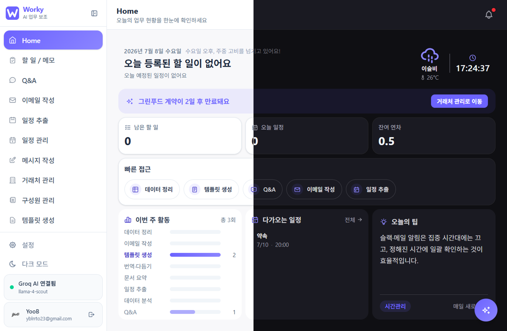
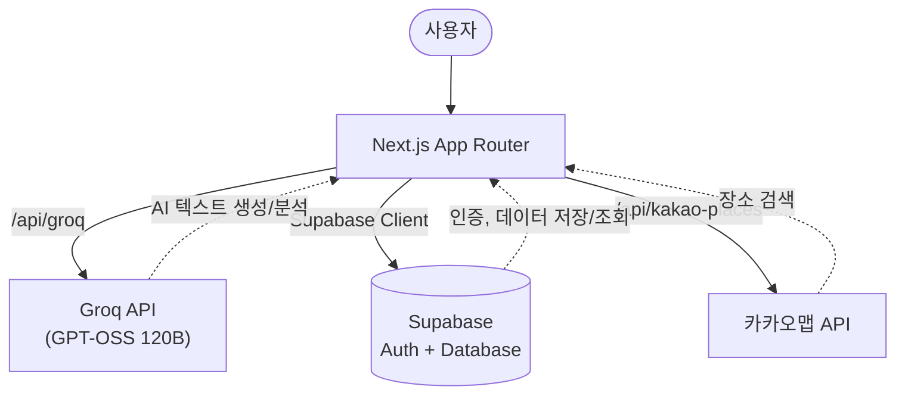
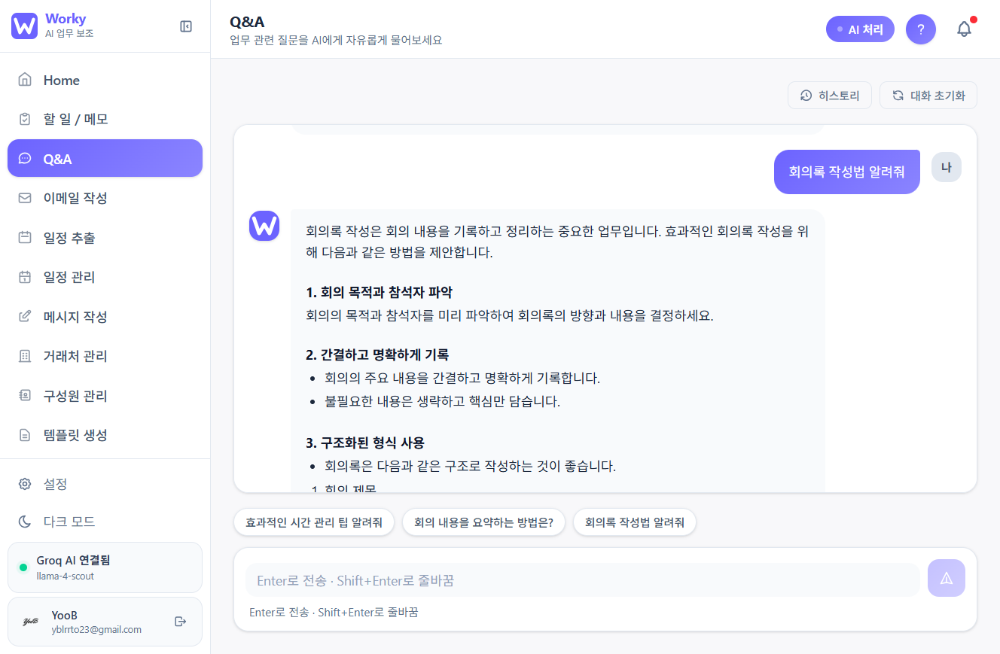
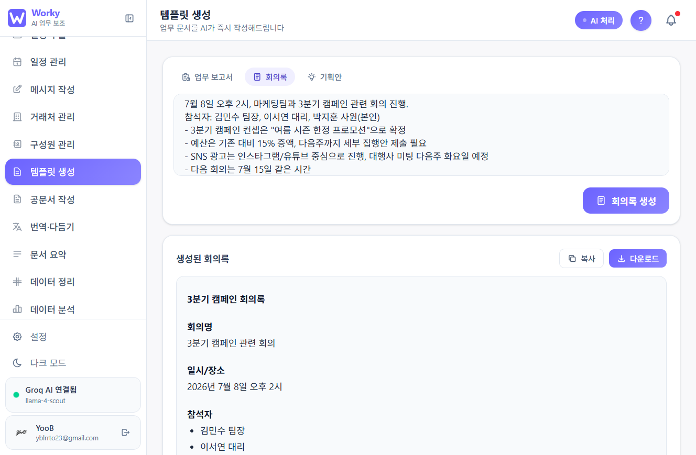
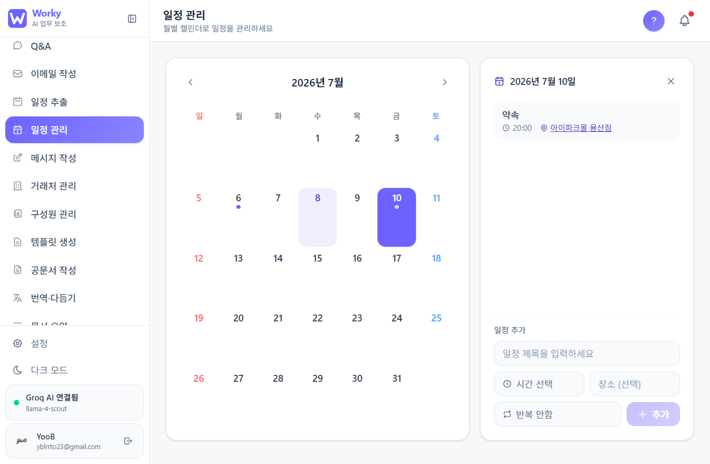
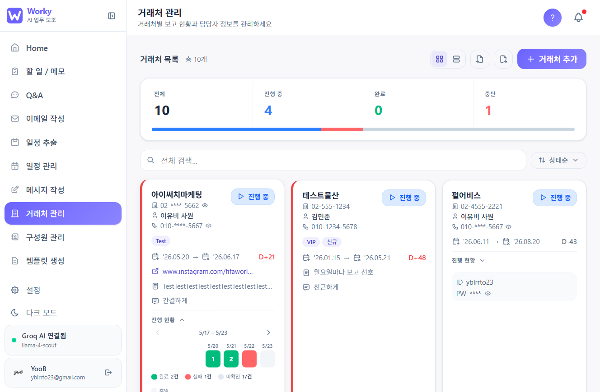

<div align="center">

# 🅦 Worky

### AI 업무 보조 도구

신입부터 실무자까지, 직장인을 위한 AI 기반 업무 보조 웹 앱

반복적인 업무 문서 작성, 일정 정리, 거래처 관리 등을 AI가 빠르게 처리해 드립니다.

**[🔗 지금 사용해보기](https://worky-ai.vercel.app)**

로그인 화면에서 **"게스트로 체험하기"**를 선택하면 회원가입 없이 더미 데이터로 바로 둘러보실 수 있습니다.

<br/>


</div>

<br/>

<p align="center">
  
</p>

<br/>

<details>
<summary><strong>📑 목차</strong></summary>
<br/>

- [왜 만들었나](#왜-만들었나)
- [기술 스택](#기술-스택)
- [아키텍처](#아키텍처)
- [주요 기능](#주요-기능)
- [개발 프로세스](#개발-프로세스)
- [트러블슈팅 & 배운 점](#트러블슈팅--배운-점)
- [프로젝트 구조](#프로젝트-구조)
- [로컬 실행 방법](#로컬-실행-방법)
- [환경변수](#환경변수)
- [라이선스](#라이선스)

</details>

<br/>

## 왜 만들었나

마케팅 회사에서 일하는 지인이 문서 작성 양식을 매번 찾아보고, 거래처 정보를 여러 곳에 흩어놓고 관리하는 모습을 보며 시작한 프로젝트입니다. 여기에 신입사원 시절 직접 겪었던 어려움(업무 용어, 메모 정리, 메일 답장 등)을 더해 메뉴를 구성했고, 이런 반복 업무를 AI에게 맡기고 정작 중요한 판단과 소통에 시간을 쓸 수 있도록 만들었습니다.

지금은 신입 한정이 아니라 다양한 직군의 직장인이 함께 쓸 수 있는 생산성 페이지로 스코프를 넓혀가는 중입니다.

<br/>

## 기술 스택

| 영역 | 기술 |
|---|---|
| **Frontend** | Next.js 15 (App Router), TypeScript, Tailwind CSS |
| **AI** | Groq API, GPT-OSS 120B |
| **인증 / DB** | Supabase (Auth + Database), Google OAuth, Gmail API |
| **배포** | Vercel |

> **왜 Groq인가?**
> 무료 티어가 충분하고, 한국에서 제약 없이 사용 가능하며, 동급 모델 대비 응답 속도가 매우 빠릅니다.
> 초기에는 LLaMA 4 Scout를 사용했으나, 2026년 6월 Groq의 모델 지원 종료에 따라 GPT-OSS 120B로 전환했습니다.

> 이 프로젝트는 Claude Code를 아키텍처 설계 및 구현 보조 도구로 활용해 개발했으며,
> 직접 설계한 부분과 AI로 가속화한 부분은 트러블슈팅 섹션에 구체적으로 명시했습니다.

<br/>

## 아키텍처


```mermaid
flowchart TD
    User(["사용자"]) --> App["Next.js App Router"]

    App -->|"/api/groq"| Groq["Groq API<br/>(GPT-OSS 120B)"]
    App -->|"Supabase Client"| DB[("Supabase<br/>Auth + Database")]
    App -->|"/api/kakao-places"| Kakao["카카오맵 API"]

    Groq -.->|"AI 텍스트 생성/분석"| App
    DB -.->|"인증, 데이터 저장/조회"| App
    Kakao -.->|"장소 검색"| App
```

- 클라이언트에서 직접 Groq API를 호출하지 않고, `/api/groq` 서버 라우트를 경유해 API 키를 보호합니다.
- 로그인은 Supabase Auth + Google OAuth를 사용하며, 로그인 세션을 기반으로 각 API 라우트에서 인증 여부를 검사합니다.
- 포트폴리오 열람용으로 이메일/비밀번호 기반 게스트 체험 계정을 별도로 제공하며, 이메일 발송 등 일부 쓰기 작업은 서버 단에서 제한됩니다.

<br/>

## 주요 기능

### 🏠 홈 & 개인화

<details>
<summary><strong>홈 대시보드</strong></summary>
<br/>

오늘의 업무 현황을 AI가 요약해서 보여주고, 핵심 지표와 실사용 패턴 기반 추천 기능을 함께 제공합니다.
플로팅 바로가기 버튼으로 자주 쓰는 외부 사이트에 빠르게 접근할 수 있으며, 기본 제공 링크(Claude, ChatGPT, Gemini, 구글, 노션, Gmail, 네이버, Google Drive) 외에 커스텀 바로가기를 직접 추가할 수 있습니다. 유명 사이트는 브랜드 아이콘이 자동으로 적용됩니다.

</details>

<details>
<summary><strong>할 일 / 메모</strong></summary>
<br/>

날짜별 할 일 관리와 자유 메모를 지원합니다.
미완료 항목은 다음 날로 자동 이월되며, 업무·회의·개인 탭으로 메모를 구분해 관리합니다.

</details>

<details>
<summary><strong>설정</strong></summary>
<br/>

내 정보, 다크모드, 사이드바 메뉴 표시 항목, 직업군별 프리셋 등 앱 환경을 설정합니다.
입사일·입사 유형을 입력하면 잔여 연차를 자동으로 계산하며, 시간대·요일별 커스텀 인사말도 설정할 수 있습니다. 한국어/영어 언어 설정도 지원합니다.

</details>

### 🤖 AI 문서 · 커뮤니케이션

<details>
<summary><strong>Q&A</strong></summary>
<br/>

업무 관련 질문을 AI에게 자유롭게 물어볼 수 있습니다.
신입사원 업무 맥락을 고려한 답변과 대화 히스토리 유지를 지원하며, 답변은 마크다운으로 렌더링됩니다. 대화 시작 전에는 추천 질문을 먼저 보여드립니다.



</details>

<details>
<summary><strong>이메일 작성</strong></summary>
<br/>

- **새 이메일 작성**: 핵심 내용만 입력하면 AI가 맞춤법·표현을 다듬어 완성도 높은 이메일을 생성합니다.
- **답장 작성**: 받은 이메일을 붙여넣으면 AI가 톤에 맞는 답장 초안을 생성합니다.
- Gmail API 연동으로 앱에서 직접 이메일 전송이 가능합니다. (게스트 체험 계정에서는 실제 발송이 제한됩니다.)

</details>

<details>
<summary><strong>메시지 작성</strong></summary>
<br/>

완료한 작업 내용을 입력하면 AI가 보고 메시지 또는 인스타그램 게시글을 생성합니다.
거래처별 선호 톤(간결함·수치 중심·정중체 등)을 반영한 맞춤 메시지를 작성합니다.

</details>

<details>
<summary><strong>템플릿 생성</strong></summary>
<br/>

업무보고서, 회의록, 기획안, 공문서 등 업무 문서를 AI가 즉시 작성합니다.
결과물은 인라인 편집 후 복사·다운로드할 수 있으며, 텍스트 선택·검색이 가능한 PDF로도 내보낼 수 있습니다.



</details>

<details>
<summary><strong>공문서 작성</strong></summary>
<br/>

품의서, 공문, 지출결의서, 업무협조 요청서를 AI가 즉시 작성합니다.
양식별 필수 항목을 가이드하여 누락 없이 작성할 수 있으며, PDF로 다운로드해 바로 제출할 수 있습니다.

</details>

<details>
<summary><strong>번역 · 다듬기</strong></summary>
<br/>

텍스트를 원하는 언어로 번역하거나 비즈니스 톤으로 다듬어 드립니다.
원문과 결과물을 나란히 비교할 수 있습니다.

</details>

<details>
<summary><strong>문서 요약</strong></summary>
<br/>

텍스트를 붙여넣으면 AI가 핵심 내용을 글머리·표 형식으로 요약합니다.
긴 보고서나 회의록에서 액션 아이템만 빠르게 추출하는 데 유용하며, 요약본은 PDF로도 저장할 수 있습니다.

</details>

<details>
<summary><strong>피드백 정리</strong></summary>
<br/>

클라이언트 피드백을 붙여넣으면 AI가 수정사항·액션 아이템으로 깔끔하게 정리합니다.
피드백의 우선순위와 담당자를 함께 정리해 팀 공유에 바로 활용할 수 있습니다.

</details>

### 📊 데이터 · 일정 · 거래처

<details>
<summary><strong>데이터 정리</strong></summary>
<br/>

지저분한 텍스트 데이터를 AI가 분석해 정형화된 표로 변환합니다.
CSV·PDF 다운로드 및 클립보드 복사를 지원합니다.

</details>

<details>
<summary><strong>데이터 분석</strong></summary>
<br/>

숫자 데이터를 붙여넣으면 AI가 핵심 수치와 트렌드를 분석합니다.
표나 CSV 형태의 데이터를 인식해 의미 있는 인사이트를 도출합니다.

</details>

<details>
<summary><strong>일정 추출</strong></summary>
<br/>

이메일·공지·메시지에서 일정 정보를 자동으로 추출해 정리합니다.
"다음주 화요일", "다음달 첫째 주 월요일" 같은 상대적 날짜도 실제 날짜로 변환합니다.

</details>

<details>
<summary><strong>일정 관리</strong></summary>
<br/>

월별 캘린더로 일정을 등록하고 관리합니다.
한국 공휴일 및 대체공휴일이 표시되며, 카카오맵 장소 검색으로 일정 장소를 바로 추가할 수 있습니다.



</details>

<details>
<summary><strong>거래처 관리</strong></summary>
<br/>

거래처별 보고 현황, 담당자 정보, 계약 기간을 통합 관리합니다.
계약 D-day 자동 계산, GitHub 스타일 잔디밭 그리드로 일별 진행 현황 시각화, 카카오맵 장소 연동을 지원합니다.



</details>

<details>
<summary><strong>구성원 관리</strong></summary>
<br/>

팀 구성원 정보를 등록하고 관리합니다.

</details>

<details>
<summary><strong>용어집</strong></summary>
<br/>

사내 용어·약어를 등록하고 AI로 뜻을 설명받을 수 있습니다.
팀마다 다른 내부 용어를 한 곳에서 관리하고 빠르게 검색합니다.

</details>

### 🐞 이슈 정리

<details>
<summary><strong>이슈 정리</strong></summary>
<br/>

발견한 버그나 개선사항을 자유롭게 서술하면 AI가 예상 동작·실제 동작·재현 방법·환경·발생 빈도·심각도로 구조화합니다.
설정 페이지에서 GitHub 저장소와 개인 액세스 토큰을 연결하면, 정리된 이슈를 바로 GitHub Issue로 등록할 수 있습니다.
등록한 이슈는 페이지 하단에서 전체/열림/닫힘으로 필터링해 확인할 수 있으며, GitHub에서 이슈 상태가 바뀌면 웹훅과 Supabase Realtime을 통해 새로고침 없이 화면에 즉시 반영됩니다.

</details>

### 🌐 다국어 & 접근성

한국어/영어 전체 다국어를 지원하며, 스크린리더 호환성과 색상 대비 등 접근성 기준을 준수합니다.
각 페이지 우측 상단의 도움말 버튼을 통해 기능별 사용법을 바로 확인할 수 있습니다.

<br/>

## 개발 프로세스

PR이 열리면 [CodeRabbit](https://coderabbit.ai)이 자동으로 코드를 리뷰하고, 그 결과를 Claude Code 에이전트(GitHub Actions)가 다시 읽어 안전하게 고칠 수 있는 문제는 직접 수정·커밋하며, 보안이나 설계처럼 판단이 필요한 사안은 자동 반영하지 않고 Slack으로 사람에게 확인을 요청합니다. 문제가 없거나 해결됐을 때만 자동으로 병합되며, 발견된 결함·처리 결과·병합 내역은 각각 별도의 Slack 채널로 전달됩니다. Claude Code로 작성 중인 코드를 다른 AI(CodeRabbit)로 한 번 더 교차 검증하는 구조입니다. 발견된 결함은 Worky의 이슈 정리 페이지와 동일한 방식으로 GitHub Issue에도 자동 등록되어, 실제 제품 기능과 개발 프로세스가 같은 파이프라인을 공유합니다.

<br/>

## 트러블슈팅 & 배운 점

QA 엔지니어로 일하며 익힌 "결함을 먼저 의심하고 검증하는" 습관이 프론트엔드 개발에서도 그대로 도움이 되고 있습니다.

- **인증 체크 누락 (API 키 무단 사용 위험)**: `/api/groq`, `/api/kakao-places`가 로그인 확인 없이 열려 있어 누구나 직접 호출해 API 키를 소진시킬 수 있는 구조였습니다. 서버 사이드에서 `supabase.auth.getUser()`로 검증하도록 수정했고, 이후 게스트 체험 계정 기능을 만들며 다른 라우트와 비교하다 `/api/gmail`에만 이 검증이 빠진 것도 추가로 발견해 마저 막았습니다.
- **모달이 화면 하단을 못 덮는 레이아웃 버그**: 여러 모달이 스크롤되는 `<main>` 컨테이너 내부에서 `position: fixed`로 렌더링되고 있었던 게 원인이었습니다. `createPortal`로 `document.body`에 직접 렌더링하도록 바꿔 근본적으로 해결했습니다.
- **Q&A 히스토리 중복 저장**: 스트리밍 응답이 완료되기 전에 저장 로직이 여러 번 호출되던 문제를
발견했습니다. 현대오토에버 MyHyundai 앱 QA 당시, 주소 즐겨찾기를 1회 등록했는데 즐겨찾기 탭에
동일 항목이 중복으로 표시되는 결함을 찾았던 경험이 있는데, 두 사례 모두 "완료되지 않은 상태에서
저장 로직이 여러 번 실행된다"는 같은 유형의 결함이었습니다. 이 패턴을 알고 있었기에 스트리밍
완료 시점을 명확히 특정해 그 시점에만 1회 저장하도록 수정했습니다.
- **Groq 모델 지원 종료 대응**: 오랜만에 접속했더니 AI 연결이 실패해 있었습니다. Groq가 사용 중이던 모델(`llama-4-scout`)의 지원을 종료한 상태였고, 공식 마이그레이션 가이드를 참고해 `gpt-oss-120b`로 교체한 뒤 Q&A·데이터 정리·일정 추출 등 AI 응답을 파싱하는 기능들을 직접 테스트해 형식이 깨지지 않는지 확인하고 배포했습니다.
- **상대적 날짜 표현 오변환**: "다음주 화요일" 같은 표현을 추출하면 실제 날짜가 아닌 오늘 날짜로 저장되는 문제가 있었습니다. AI 프롬프트에 오늘 날짜를 명시적으로 포함시켜 1차로 해결했지만, "다음달 첫째 주 월요일"처럼 복잡한 표현은 여전히 잘못 계산됐습니다(7월 1일로 계산됐는데 정답은 7월 7일). 예시로 직접 검증하며 어떤 패턴에서 계산이 틀리는지 좁혀나갔고, 프롬프트를 한 번 더 보강해 해결했습니다.
- **조용히 실패하는 자동화**: 매일 자동 알림을 보내는 Edge Function이 설정 하나가 비활성화된 채로 계속 실패하고 있었고, 릴리스 공지를 Supabase에 올리는 GitHub Actions는 워크플로우 자체는 "success"로 표시됐지만 CHANGELOG 안의 큰따옴표가 JSON을 깨뜨려 실제로는 매번 실패하고 있었습니다. 둘 다 겉보기엔 정상이라 오래 방치될 수 있는 유형이라, 이후 HTTP 상태 코드를 명시적으로 검사하도록 스크립트를 보강했습니다.
- **PR 검증 파이프라인의 "확실하지 않으면 통과" 구멍**: 위 개발 프로세스를 처음 구현했을 때, "이 PR을 자동으로 병합해도 되는가"를 판단하는 조건들이 전부 값이 비어 있거나 예상과 다르면 오히려 통과되는 방향으로 짜여 있었습니다. `jq`의 `// 기본값` 문법이 `false`를 "없는 값"으로 취급해 안전 판단을 뒤집거나, 판단 스텝 자체가 실패했을 때 그 실패가 아무 표시 없이 넘어가 결과적으로 자동 병합 조건을 만족해버리는 식이었습니다. 같은 유형의 문제가 여러 지점에서 반복적으로 발견되어, "판단 근거가 확실할 때만 자동으로 진행하고, 애매하거나 실패하면 무조건 사람에게 넘긴다"는 원칙으로 조건을 전부 뒤집었습니다.

> 더 자세한 변경 이력은 [`CHANGELOG.md`](./CHANGELOG.md)에서 확인하실 수 있습니다.

<br/>

## 프로젝트 구조

```
src/
  app/          # Next.js App Router 페이지 및 API 라우트
  components/   # UI 컴포넌트
  contexts/     # React Context (Toast 등)
  hooks/        # 커스텀 훅
  lib/          # 유틸리티, DB 함수, 설정
  types/        # TypeScript 타입 정의
```

<br/>

## 로컬 실행 방법

```bash
# 1. 저장소 클론
git clone https://github.com/yoobilee/worky.git
cd worky

# 2. 의존성 설치
npm install

# 3. 환경변수 설정
cp .env.example .env.local
# .env.local에 필요한 값 입력

# 4. 개발 서버 실행
npm run dev
```

브라우저에서 [http://localhost:3000](http://localhost:3000) 접속

<br/>

## 환경변수

`.env.local` 파일에 아래 변수를 설정하세요.

```env
# Groq API — https://console.groq.com
GROQ_API_KEY=

# Supabase — https://supabase.com
NEXT_PUBLIC_SUPABASE_URL=
NEXT_PUBLIC_SUPABASE_ANON_KEY=
SUPABASE_SERVICE_ROLE_KEY=

# 카카오 API — https://developers.kakao.com
KAKAO_REST_API_KEY=
NEXT_PUBLIC_KAKAO_MAP_KEY=

# 배포 URL (GitHub 웹훅 콜백 주소로 사용)
NEXT_PUBLIC_SITE_URL=
```

> `GROQ_API_KEY`는 서버 사이드(`/api/groq`)에서만 사용되며 클라이언트에 노출되지 않습니다.
> `SUPABASE_SERVICE_ROLE_KEY`는 RLS를 우회하는 관리자 권한 키로, GitHub 웹훅 처리(`/api/webhooks/github`)에서만 사용되며 절대 클라이언트에 노출되지 않습니다.

### Google OAuth 설정

로그인 기능은 Supabase + Google OAuth를 사용합니다.

1. **Supabase 대시보드** → Authentication → Providers → Google 활성화
2. **Google Cloud Console** → API 및 서비스 → OAuth 2.0 클라이언트 ID 생성 후 Client ID / Secret을 Supabase에 입력
3. 승인된 리디렉션 URI에 `https://<your-supabase-project>.supabase.co/auth/v1/callback` 추가

<br/>

## 라이선스

Copyright © 2026 yoobilee. All Rights Reserved.